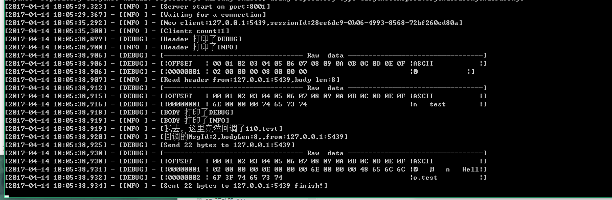
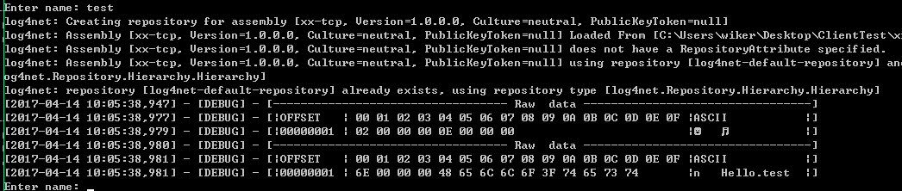
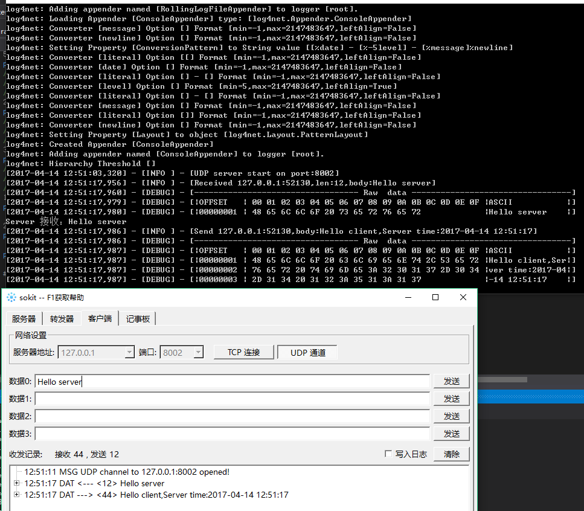

# xx-net-server
Github：https://github.com/wikeryong/xx-net-server
## 说明


1. 实现了Server监听和简单的事件处理
2. 兼容长连接和短连接
3. 支持同时启动多个Server（监听不同的端口）
4. 并没有实现解析结构体的工作（下一步可能会做）
5. 可能不太适用于大量IO的项目，本项目为了主要为了实现针对数量不多TCP通信（后续将进行压力测试）
6. 你需要做的就是处理每个消息的事件再分发。就是这么简单！

## 快速开始
### TCP Server

``` C#
//创建一个Server，二个参数：
// name：用于区别多个server的标志。
// createHeader：实例化你用到的Header继承于xxHeader
xxTCPAsyncServer server = xxTCPServer.CreateServer("test1", CreateHeader);
server.PrintReceiveHex = true; //开启打印接收到数据的Hex
server.PrintSendHex = true; //开启打印发送数据的Hex
server.HeaderLength = 8; // 协议中消息头的长度。这个必须设置
server.MainNotify += MainHandler; //一个消息接收完之后的事件处理。
server.Start(8001);
```

### UDP Server
``` C#
xxUDPAsyncServer server = xxUDPServer.CreateUDPServer("wiker", 8002);
//下面的事件都是可以用的
//server.CompletedSend += 发送完成事件
//server.PrepareSend += 发送数据之前的事件
//server.NetError += 网络接收错误事件
//server.OtherException += 其它异常事件
server.DataReceived += (asyncServer, arg) =>
{
    xxStrBody strBody = (xxStrBody)arg.UdpBody;
    Console.WriteLine("Server 接收："+strBody.Content);
    asyncServer.Send(arg.State.remote, "Hello client,Server time:"+DateTime.Now);
};
server.Start();
Thread.Sleep(1000000);
```

### Log 使用
继承xxLogManager
``` C#
public class LogManager:xxLogManager
{
    private static ILog LOG = log4net.LogManager.GetLogger(MethodBase.GetCurrentMethod().DeclaringType);
    public override void Debug(object msg)
    {
        LOG.Debug(msg);
    }

    public override void DebugFormat(string msg, params object[] args)
    {
        LOG.DebugFormat(msg,args);
    }

    public override void Debug(object msg, Exception exception)
    {
        LOG.Debug(msg,exception);
    }

    public override void Info(object msg)
    {
        LOG.Info(msg);
    }

    public override void InfoFormat(string msg, params object[] args)
    {
        LOG.InfoFormat(msg,args);
    }

    public override void Info(object msg, Exception exception)
    {
        LOG.Info(msg,exception);
    }

    public override void Warn(object msg)
    {
        LOG.Warn(msg);
    }

    public override void Warn(object msg, Exception exception)
    {
        LOG.Warn(msg,exception);
    }

    public override void WarnFormat(string msg, params object[] args)
    {
        LOG.WarnFormat(msg,args);
    }

    public override void Error(object msg)
    {
        LOG.Error(msg);
    }

    public override void Error(object msg, Exception exception)
    {
        LOG.Error(msg,exception);
    }

    public override void ErrorFormat(string msg, params object[] args)
    {
        LOG.ErrorFormat(msg,args);
    }
}
```

实现xxLogger
``` C#
public class MyLogger : xxLogger
{
    public xxLogManager CreateLogManager(Type type)
    {
        return new LogManager();
    }
}

//将接口传入，便可以使用日志了。当然如果你不想这么麻烦可以直接引用源码
xxLogManager.Logger = new MyLogger();
```

## Demo
可以运行ServerTest中的start和ClientTest中的start。xx-tcp-test中有详细的测试代码
### TCP Test




### UDP Test

## TODO
1. Http Server
2. FTP Server
3. 压力测试
4. 代码优化等 